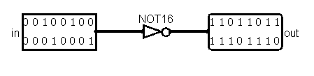
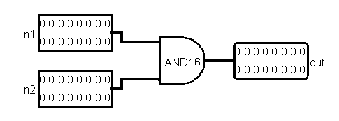
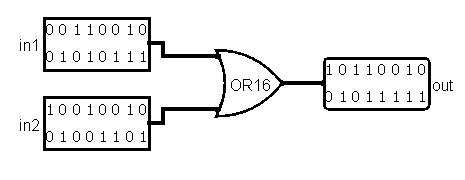
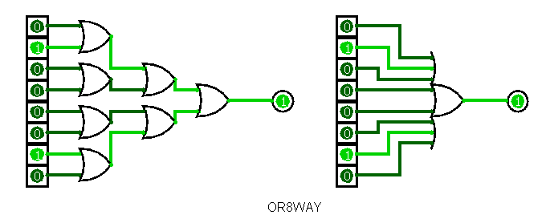
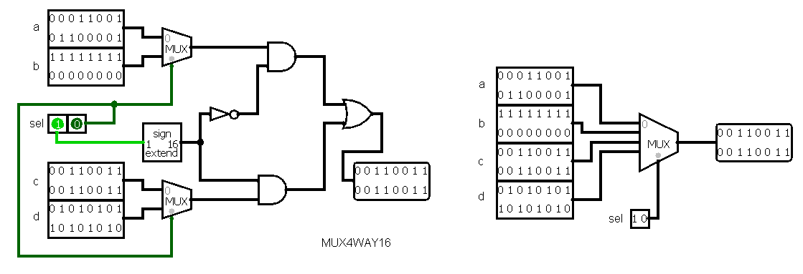
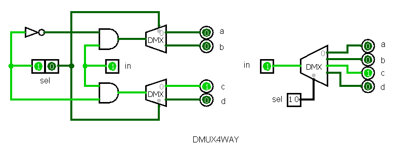

# Project 1: Boolean Logic

**Last updated: 23-4-2019**

## Projects:
### NAND Gate
NAND gate will be used as the fundamental building block for most logic gates in this nand2tetris course.

 a | b | out
 --- | --- | ---
 0 | 0 | 1
 0 | 1 | 1
 1 | 0 | 1
 1 | 1 | 0

Common elementary logic gates are And, Or, Not, Xor, etc.  As some logic gates comprising of many Nand logic gates can become too packed and confusing to read, they will be abstracted instead and used as one of the components for several other logic gates, which are also known as composite gates. For example, Xor logic gate will be `And(Nand(a, b), Or(a, b))` instead of `Nand(Nand(Nand(a,b), Nand(Nand(a, a), Nand(b, b)), Nand(Nand(a,b), Nand(Nand(a, a), Nand(b, b)))` (Too ugly…).

Hardware Description Language (HDL) is used as one modelling framework to plan and test a certain chip architecture in a computer. Using the provided program Hardware Simulator (and [Logisim](http://www.cburch.com/logisim/) to create schematics of logic gates), various common logic gates can be made and tested virtually and easily while still be able to yield desired results which are comparable to hardware counterparts.

### NOT Gate
Also known as "converter", it returns negation of input.
`Not(in) = Nand(in, in)`

 in | out
 --- | ---
 0 | 1
 1 | 0

### AND Gate
Returns the overlapping part of A and B.
`And(a, b) = Not(Nand(a, b))`

 a | b | out
 --- | --- | --- 
 0 | 0 | 0
 0 | 1 | 0
 1 | 0 | 0
 1 | 1 | 1

### OR Gate
Returns either A or B, including the overlapping part of A and B.
`Or(a, b) = Nand(Not(a), Not(b))`

 a | b | out 
 --- | --- | ---
 0 | 0 | 0
 0 | 1 | 1
 1 | 0 | 1
 1 | 1 | 1

### XOR Gate
Exclusive or, returns either A or B but not the overlapping part of A and B.
`Xor(a, b) = And(Nand(a, b), Or(a, b))`

 a | b | out
 --- | --- | ---
 0 | 0 | 0
 0 | 1 | 1
 1 | 0 | 1
 1 | 1 | 0

### Multiplexer (MUX)
Plexors (or Multiplexers) are three-input logic gates that has an input as selection bit to be used to select one of the two inputs as output. They can also be known as “selectors”. 
Returns one output of a or b based on the state of sel.
`Mux(a, b, sel) = Or(And(Not(sel), a), And(sel, b))`

 a | b | sel | out
 --- | --- | --- | ---
 0 | 0 | **0** | 0
 0 | 1 | **0** | 0
 1 | 0 | **0** | 1
 1 | 1 | **0** | 1
 0 | 0 | **1** | 0
 0 | 1 | **1** | 1
 1 | 0 | **1** | 0
 1 | 1 | **1** | 1

### Demultiplexer (DMUX)
Demultiplexers are the opposite of multiplexers, which they select which one of the two outputs based on the state of the selection bit.
Returns the input on outputs a or b based on the state of sel
`DMux(in, sel) = (And(in, Not(sel)), And(in, sel)) = (a, b)`

 in | sel | a | b
 --- | --- | --- | ---
 0 | **0** | 0 | 0
 0 | **1** | 0 | 0
 1 | **0** | 1 | 0
 1 | **1** | 0 | 1

### Multi-bit and Multi-way Gates
Multi-bit logic gates (termed buses) allow one to handle larger capacity of integers. In any `n`-bit bus, for example named `data`, each individual bit can be referred using this notation:
`data[0], data[1], ..., data[n-1], data[n]`

### Not16

For Not16, to access each bit individually for both input and output, it can be accessed as shown below.
`Not(in=in[0], out=out[0])` for bit 1
`Not(in=in[15], out=out[15])` for bit 16

### And16, Or16
Same goes for And16 and Or16, just with an extra input.
`Or(in1=in1[0], in2=in2[0], out=out[0])` for bit 1
`Or(in1=in1[15], in2=in2[15], out=out[15])` for bit 16

For multi-way buses, they have multiple inputs and/or multiple outputs.
### Or8Way
It comprises of several Or gates to accommodate 8 inputs to yield one single output. Each Or gate only allows 2 inputs, thus in this case, for _n_ number of inputs (usually it must be 2^_n_ inputs), (_n_ - 1) number of Or gates is required.

### Mux4Way16, Mux8Way16, DMux4Way, DMux8Way
For _m_-way multiplexers, in order to accommodate for _m_ number of inputs to yield one desired output, the selector will be a set of control bits of log2(_m_). 
For example, for this Mux4Way16, 4-way will have a total of 2 control bits as shown below.

sel[1] | sel[0] | out
--- | --- | --- 
0 | 0 | a
0 | 1 | b
1 | 0 | c
1 | 1 | d

Mux8Way16 will have similar construction as Mux4Way16, with the difference of having 3 control bits to select the output.

While for _m_-way demultiplexers, through a selector or set of control bits of log2(_m_), one can selectively output the input to output bit based on specified control bit.
Below is the construction of DMux4Way, 4-way demultiplexer.

Table below explains everything what I want to explain :sweat_smile:

sel[1] | sel[0] | a | b | c | d
--- | --- | --- | --- | --- | ---
0 | 0 | in | 0 | 0 | 0
0 | 1 | 0 | in | 0 | 0
1 | 0 | 0 | 0 | in | 0
1 | 1 | 0 | 0 | 0 | in

DMux8Way will have similar construction as DMux4Way, with the difference of having 3 control bits to select the output.
