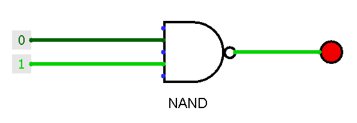
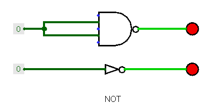
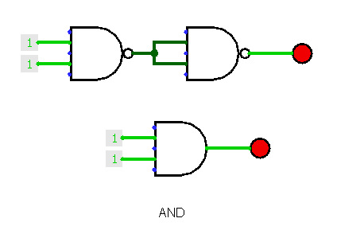
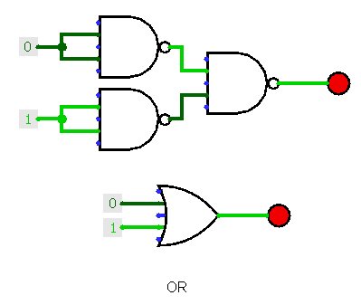
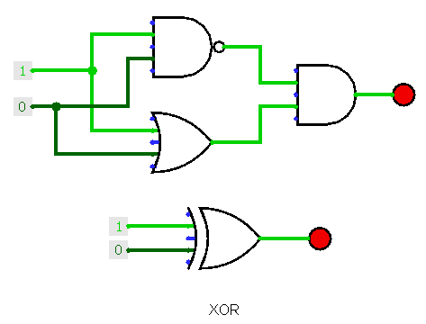
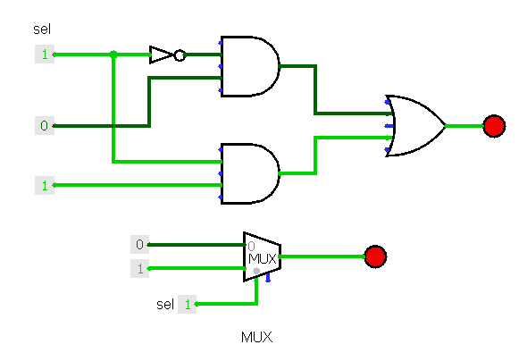
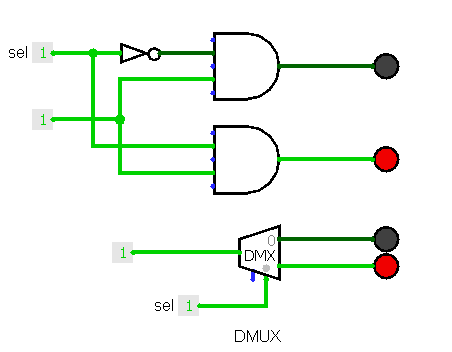

# Project 1: Boolean Logic

**Last updated: 28-12-2018**

## Projects:
### NAND Gate
NAND gate will be used as the fundamental building block for most logic gates in this nand2tetris course.

 a | b | out
 --- | --- | ---
 0 | 0 | 1
 0 | 1 | 1
 1 | 0 | 1
 1 | 1 | 0

Common elementary logic gates are And, Or, Not, Xor, etc.  As some logic gates comprising of many Nand logic gates can become too packed and confusing to read, they will be abstracted instead and used as one of the components for several other logic gates, which are also known as composite gates. For example, Xor logic gate will be `And(Nand(a, b), Or(a, b))` instead of `Nand(Nand(Nand(a,b), Nand(Nand(a, a), Nand(b, b)), Nand(Nand(a,b), Nand(Nand(a, a), Nand(b, b)))` (Too ugly…).

Hardware Description Language (HDL) is used as one modelling framework to plan and test a certain chip architecture in a computer. Using the program Hardware Simulator (and Logisim to create schematics of logic gates), various common logic gates can be made and tested virtually and easily while still be able to yield desired results which are comparable to hardware counterparts.

### NOT Gate
Returns negation of input.
`Not(in) = Nand(in, in)`

 in | out
 --- | ---
 0 | 1
 1 | 0

### AND Gate
Returns the overlapping part of A and B.
`And(a, b) = Not(Nand(a, b))`

 a | b | out
 --- | --- | --- 
 0 | 0 | 0
 0 | 1 | 0
 1 | 0 | 0
 1 | 1 | 1

### OR Gate
Returns either A or B, including the overlapping part of A and B.
`Or(a, b) = Nand(Not(a), Not(b))`

 a | b | out 
 --- | --- | ---
 0 | 0 | 0
 0 | 1 | 1
 1 | 0 | 1
 1 | 1 | 1

### XOR Gate
Exclusive or, returns either A or B but not the overlapping part of A and B.
`Xor(a, b) = And(Nand(a, b), Or(a, b))`

 a | b | out
 --- | --- | ---
 0 | 0 | 0
 0 | 1 | 1
 1 | 0 | 1
 1 | 1 | 0

### Multiplexor (MUX)
Plexors (or Multiplexers) are three-input logic gates that has an input as selection bit to be used to select one of the two inputs as output. They can also be known as “selectors”. 
Returns one output of a or b based on the state of sel.
`Mux(a, b, sel) = Or(And(Not(sel), a), And(sel, b))`

 a | b | sel | out
 --- | --- | --- | ---
 0 | 0 | **0** | 0
 0 | 1 | **0** | 0
 1 | 0 | **0** | 1
 1 | 1 | **0** | 1
 0 | 0 | **1** | 0
 0 | 1 | **1** | 1
 1 | 0 | **1** | 0
 1 | 1 | **1** | 1

### Demultiplexor (DMUX)
Demultiplexers are the opposite of multiplexers, which they select which one of the two outputs based on the state of the selection bit.
Returns the input on outputs a or b based on the state of sel
`DMux(in, sel) = (And(in, Not(sel)), And(in, sel)) = (a, b)`

 in | sel | a | b
 --- | --- | --- | ---
 0 | **0** | 0 | 0
 0 | **1** | 0 | 0
 1 | **0** | 1 | 0
 1 | **1** | 0 | 1

### Multi-bit and Multi-way Gates
Multi-bit logic gates (termed buses) allow one to handle larger capacity of integers. In any `n`-bit bus, for example named `data`, each individual bit can be referred using this notation:
`data[0], data[1], ..., data[n-1], data[n]`

### Not16, And16, Or16, Mux16

Or8Way, Mux4Way16, Mux8Way16, DMux4Way, DMux8Way
